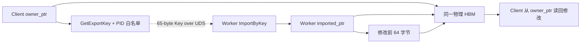
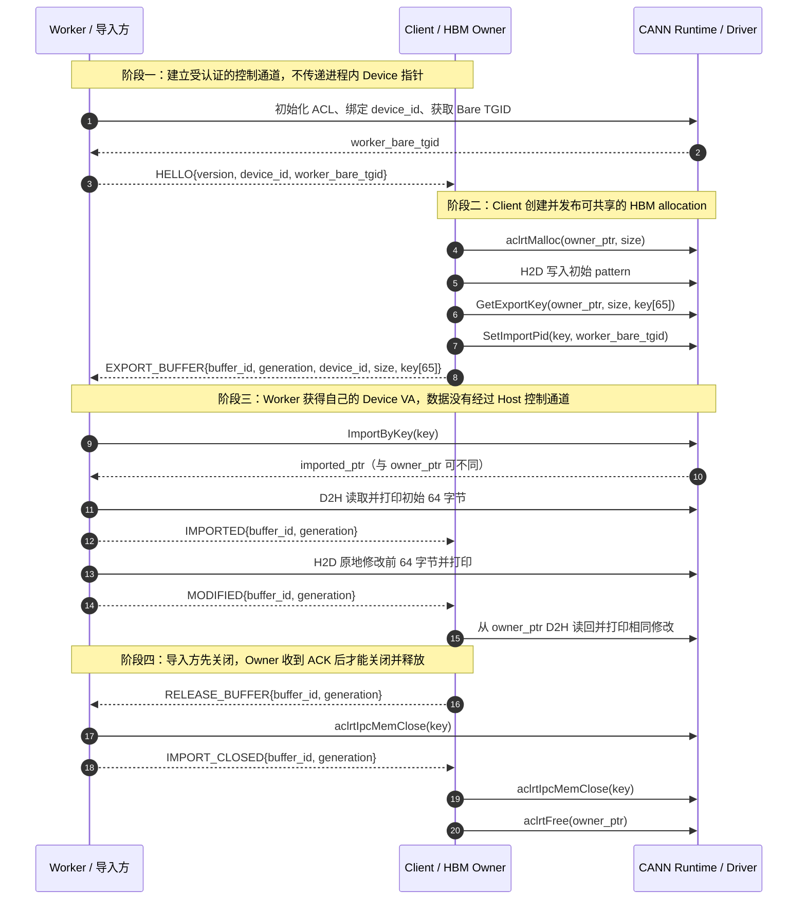
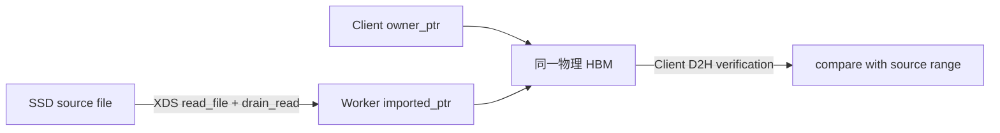

# Ascend HBM IPC Key 双进程 Demo

该项目用两个独立 Linux 进程验证昇腾 CANN Device Memory IPC：

- `client`：HBM Owner，调用 `aclrtMalloc`、导出 IPC Key，并最终释放原始 HBM；
- `worker`：Importer，通过 Key 获得自己的 Device VA，读取并原地修改同一物理 HBM；
- 可选 XDS 路径：Worker 把导入后的本进程 Device VA 交给 XDS，直接从 SSD 文件读取到共享 HBM；
- `scripts/run_demo.sh`：构建并拉起 Worker、Client 两个进程。

Demo 默认要求两个进程使用同一个 Device ID。默认模式验证 ACL IPC 映射和同步 Memcpy；开启 XDS 后验证
SSD 文件是否能写入 Worker 导入的 Client HBM。两种模式都不包含 HIXL、HCCS 或 RDMA 注册。

## 原理



Key 不是地址、FD 或数据副本。Client 和 Worker 的 Device VA 数值可以不同，但它们映射同一组物理 HBM 页。

## 关键流程



控制面实际交换的是固定长度协议消息，不发送 `owner_ptr` 或 `imported_ptr`：

| 消息 | 方向 | 关键字段 | 作用 |
|---|---|---|---|
| `HELLO` | Worker → Client | 协议版本、Device ID、Worker Bare TGID | 建立设备和白名单身份 |
| `EXPORT_BUFFER` | Client → Worker | Buffer ID、generation、Device ID、size、65 字节 Key | 发布一个 HBM allocation |
| `IMPORTED` | Worker → Client | Buffer ID、generation | 确认 Worker 已建立映射 |
| `MODIFIED` | Worker → Client | Buffer ID、generation | 通知 Client 可以从 owner VA 校验数据 |
| `RELEASE_BUFFER` | Client → Worker | Buffer ID、generation | 停止使用并要求关闭导入映射 |
| `IMPORT_CLOSED` | Worker → Client | Buffer ID、generation | 允许 Client Close Key 并 Free HBM |

## 目录

```text
ascend-hbm-ipc-demo/
├── CMakeLists.txt
├── README.md
├── build.sh
├── scripts/
│   ├── run_demo.sh
│   └── xds_module.sh
├── tests/
│   └── xds_reader_test.cpp
├── third_party/xds/
│   ├── file_p2p/
│   └── p2p_dev.c
└── src/
    ├── client.cpp
    ├── ipc_common.h
    ├── xds_reader.cpp
    ├── xds_reader.h
    └── worker.cpp
```

## 环境要求

- Ascend 910B/Atlas A2 等支持 IPC Key 的产品形态；
- 匹配的驱动、固件和 CANN Runtime；
- 两个进程都能访问相同的 `/dev/davinci*` 设备；
- 已加载 CANN 环境变量。

XDS 模式还要求：

- 源文件位于 XDS 支持的本地 NVMe 文件系统，文件 offset、目标 HBM VA 和 size 均为 512 字节对齐；
- 实验内核、NVMe 驱动和 Ascend 驱动导出 XDS 所需符号；
- 管理员已加载匹配当前内核的 `p2p_dev.ko`，运行用户可访问 `/dev/p2p_device` 和源块设备；
- XDS I/O 完成前，源文件、Worker 导入映射和 Client Owner allocation 都保持存活。

例如：

```bash
source /usr/local/Ascend/ascend-toolkit/set_env.sh
```

具体路径以安装环境为准。

## 构建

```bash
cd /home/lipeijie/ascend-hbm-ipc-demo
cmake -S . -B build -DCMAKE_BUILD_TYPE=Release
cmake --build build -j
```

构建 XDS 用户态路径并运行无硬件预检测试：

```bash
cmake -S . -B build -DCMAKE_BUILD_TYPE=Release -DENABLE_XDS=ON
cmake --build build -j
ctest --test-dir build --output-on-failure
```

内核模块是显式管理动作，不属于默认构建或 Worker 启动流程：

```bash
cmake --build build --target xds_kernel_module
bash scripts/xds_module.sh status
# 由管理员确认兼容性后执行：
sudo bash scripts/xds_module.sh load
```

## 一键拉起两个进程

构建、测试并执行 XDS SSD→共享 HBM 验证（默认 Device 0、2 MiB）：

```bash
./build.sh
```

若 `/dev/p2p_device` 尚未就绪，可在管理员确认模块兼容后允许脚本调用 `sudo` 加载：

```bash
XDS_LOAD_MODULE=1 ./build.sh
```

指定已有 SSD 文件、块设备、Device ID 和 Buffer 大小：

```bash
XDS_FILE=/mnt/nvme/xds-test.bin \
XDS_BLOCK_DEVICE=/dev/nvme0n1p2 \
./build.sh 0 2097152
```

仅运行原有非 XDS HBM IPC 验证：

```bash
XDS_ENABLE=0 ./build.sh
```

`build.sh --help` 可查看全部环境变量。默认只构建内核模块，不自动加载；模块加载属于显式管理员操作。

也可以直接调用底层运行脚本：

默认使用 Device 0 和 2 MiB HBM：

```bash
bash scripts/run_demo.sh
```

指定 Device ID 和 Buffer 大小；大小必须是 2 MiB 的整数倍：

```bash
bash scripts/run_demo.sh 1 16777216
```

成功时应看到类似输出：

```text
[Client] 初始 pattern（打印前 64/2097152 字节）
  [0000] 11 94 1c 9f 27 aa 32 b5 3d c0 48 cb 53 d6 5e e1
[Worker] imported HBM: imported_ptr=..., size=2097152
[Worker] 从 imported_ptr 读到的初始数据（打印前 64/2097152 字节）
  [0000] 11 94 1c 9f 27 aa 32 b5 3d c0 48 cb 53 d6 5e e1
[Worker] 写入 imported_ptr 后的数据（打印前 64/2097152 字节）
  [0000] a5 a5 a5 a5 a5 a5 a5 a5 a5 a5 a5 a5 a5 a5 a5 a5
[Worker] modified the first 64 bytes through imported_ptr
[Client] 从 owner_ptr 读回 Worker 修改后的数据（打印前 64/2097152 字节）
  [0000] a5 a5 a5 a5 a5 a5 a5 a5 a5 a5 a5 a5 a5 a5 a5 a5
[Client] observed Worker's in-place HBM mutation through owner_ptr
PASS: two process-local Device VAs accessed the same physical HBM
```

程序默认只打印前 64 字节，既能观察共享前后的变化，也避免大 Buffer 测试时刷屏；完整 Buffer 仍会逐字节校验。

## XDS SSD→共享 HBM 验证

`XDS_ENABLE=1` 时，脚本会以 `ENABLE_XDS=ON` 构建并运行以下路径：



Worker 在该分支不调用 `aclrtMemcpy` 搬运 payload。它把 `aclrtIpcMemImportByKey` 返回的 Worker 本地 VA 直接写入
`read_parameter.addr`，`read_file` 成功后调用 `drain_read`，只有 drain 成功才通知 Client。Client 随后从 Owner VA
D2H 并逐字节对比源文件范围。

使用脚本自动在 `/tmp` 创建并清理测试文件、自动解析文件系统块设备：

```bash
XDS_ENABLE=1 bash scripts/run_demo.sh 0 2097152
```

使用已准备好的 SSD 文件和显式块设备：

```bash
XDS_ENABLE=1 \
XDS_FILE=/mnt/nvme/xds-test.bin \
XDS_BLOCK_DEVICE=/dev/nvme0n1p2 \
XDS_FILE_OFFSET=0 \
XDS_VF_ID=0 \
bash scripts/run_demo.sh 0 2097152
```

脚本不会修改显式传入的 `XDS_FILE`；其大小必须覆盖 `XDS_FILE_OFFSET + BUFFER_SIZE`，运行期间也不能被改写、
截断或删除。`PASS` 表示 XDS drain 完成后 Client Owner VA 中的字节与 SSD 文件范围一致，并验证了
“XDS 可写 Worker 导入 VA”这一功能链路。若还要证明 DMA 未经 Host DRAM，应同时采集 NVMe/PCIe trace、Ascend
counter 或内存带宽指标；仅凭最终字节一致不能证明物理 DMA 路径。

## 手工启动

终端 1：

```bash
./build/worker /tmp/ascend-hbm-ipc-demo.sock 0
```

终端 2：

```bash
./build/client /tmp/ascend-hbm-ipc-demo.sock 0 2097152
```

## 为什么能证明不是复制

Worker 导入后先校验 Client 写入的完整 pattern，再只通过 `imported_ptr` 修改前 64 字节；Client 没有接收数据副本，
而是直接从原始 `owner_ptr` 读取并观察到修改。双向可见证明两端映射的是同一物理 HBM，而不是 Import 时生成了一份副本。

如需进一步排除隐式 Copy，可用 `msprof` 观察 `ImportByKey` 阶段：其延迟应接近固定成本，不应随 Buffer 大小线性增长，
且不应出现与 Buffer 大小相等的 D2D Copy。

## 生命周期和安全边界

- Client 是唯一 HBM Owner；Worker 绝不调用 `aclrtFree(imported_ptr)`；
- Worker 必须先 `aclrtIpcMemClose` 并发送 ACK；Client 收到 ACK 后才 Close/Free；
- UDS 权限为 `0600`，双方使用 `SO_PEERCRED` 校验同 UID；
- IPC Key 不输出到日志；
- Demo 使用 ACL PID 白名单，PID 来自 `aclrtDeviceGetBareTgid`；
- 控制连接异常后，双方终止进程，不尝试继续使用旧 VA/Key；
- 生产系统还需要 session、generation、active lease、心跳、Device Reset 恢复和 HIXL/DMA drain。

## IPC Key 跨进程共享约束

| 类别 | 约束 | 本 Demo/生产建议 |
|---|---|---|
| 共享范围 | IPC Key 用于同一物理节点、同一驱动体系内的进程间 Device 内存共享，不是跨节点传输协议 | 跨节点仍由 HIXL、HCCS、RoCE 等传输层完成 |
| 产品支持 | CANN 8.5 文档支持 A2/A3 训练和推理系列，但 Atlas 200I/500 A2 不支持 | 按完整产品型号和目标 CANN/驱动组合做运行探测 |
| Key 格式 | Key 长度固定为 65 字节，按二进制定长数据传递，不能用 `strlen` | Demo 使用 `std::array<char, 65>` 和定长 UDS 消息 |
| 身份权限 | 默认 Export flag 开启 PID 白名单；容器/虚拟机场景必须使用 `aclrtDeviceGetBareTgid` | Client 在发送 Key 前调用 `aclrtIpcMemSetImportPid` |
| 地址语义 | 导入方返回的是本进程 Device VA，数值不保证等于 Owner VA | 只交换 Key、size、Buffer ID、generation 和 offset，不交换裸指针 |
| 内存所有权 | Client 始终拥有原始 allocation；Worker 只有导入映射 | Worker 禁止对 `imported_ptr` 调用 `aclrtFree` |
| 存活要求 | Worker Import 和使用期间，Owner allocation 必须仍然存在 | Owner 不能提前 Free，也不能在 DMA/Kernel 执行中释放 |
| 关闭顺序 | 同一 Key 的所有 Importer 都要先 `aclrtIpcMemClose`，Exporter 最后 Close/Free | 多 Worker 场景必须记录每个 Importer 的状态和引用 |
| 同步语义 | Key 只建立映射和授权，不提供跨进程 Stream/Event、READY 或完成通知 | 使用控制面状态机，并在通知前完成 Stream/DMA 同步 |
| Device/Context | 两个进程独立初始化 ACL，并在调用 Import、Memcpy、Kernel 前绑定正确 Device/Context | 本 Demo 强制相同 Device ID |
| 跨 Device | 需要 Peer Access；CANN 8.5 对跨 Device 共享地址的 H2D/D2H和同步复制有额外限制 | 生产首阶段限定同 Device；跨卡单独建立能力测试矩阵 |
| 安全 | Key 是可访问 HBM 的 capability，泄露后可能绕过应用数据权限 | 不打印 Key、不持久化到 ETCD，UDS 使用 `0600` 和 `SO_PEERCRED` |
| 故障恢复 | 进程退出、Device Reset、Pod 重建后旧 VA、Key 和传输注册均不得复用 | 使用 session UUID、device epoch 和 generation 拒绝旧请求 |
| 外部组件 | `void *` 类型不代表 HIXL/HCCL/RDMA 一定接受导入地址 | 对每种传输库执行 Register、传输、Deregister 和异常实验 |

官方依据：[CANN 8.5 `aclrtIpcMemGetExportKey`](https://www.hiascend.com/document/detail/zh/canncommercial/850/API/appdevgapi/aclcppdevg_03_1934.html)、
[`aclrtIpcMemImportByKey`](https://www.hiascend.com/document/detail/zh/canncommercial/850/API/appdevgapi/aclcppdevg_03_1936.html)。

## 限制

- 未覆盖跨 Device Import 和 Peer Access；
- 未覆盖异步 Stream/Event；
- 未覆盖多个 Importer；
- 未验证 HIXL/HCCS/RoCE 注册；
- 当前机器可以完成编译链接，但必须在有可用 NPU 的 910B/A2 节点运行才能得到真实 HBM 结论。
