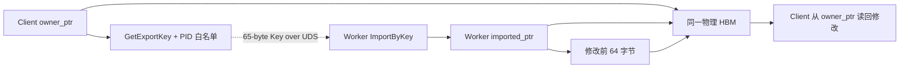
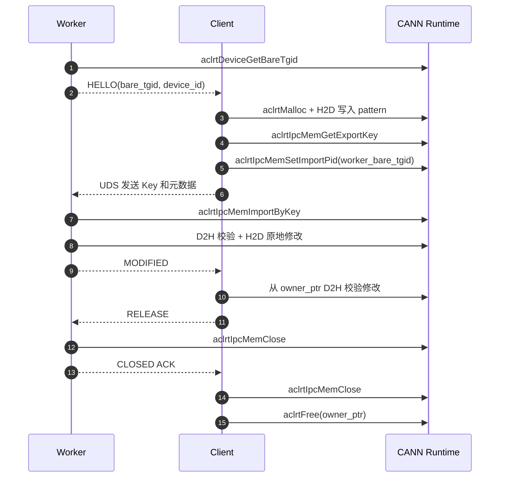

# Ascend HBM IPC Key 双进程 Demo

该项目用两个独立 Linux 进程验证昇腾 CANN Device Memory IPC：

- `client`：HBM Owner，调用 `aclrtMalloc`、导出 IPC Key，并最终释放原始 HBM；
- `worker`：Importer，通过 Key 获得自己的 Device VA，读取并原地修改同一物理 HBM；
- `scripts/run_demo.sh`：构建并拉起 Worker、Client 两个进程。

Demo 默认要求两个进程使用同一个 Device ID。它验证 ACL IPC 映射和同步 Memcpy，不包含 HIXL、HCCS 或 RDMA 注册。

## 原理



Key 不是地址、FD 或数据副本。Client 和 Worker 的 Device VA 数值可以不同，但它们映射同一组物理 HBM 页。

## 关键流程



## 目录

```text
ascend-hbm-ipc-demo/
├── CMakeLists.txt
├── README.md
├── scripts/
│   └── run_demo.sh
└── src/
    ├── client.cpp
    ├── ipc_common.h
    └── worker.cpp
```

## 环境要求

- Ascend 910B/Atlas A2 等支持 IPC Key 的产品形态；
- 匹配的驱动、固件和 CANN Runtime；
- 两个进程都能访问相同的 `/dev/davinci*` 设备；
- 已加载 CANN 环境变量。

例如：

```bash
source /usr/local/Ascend/ascend-toolkit/set_env.sh
```

具体路径以安装环境为准。

## 构建

```bash
cd /home/lipeijie/ascend-hbm-ipc-demo
cmake -S . -B build -DCMAKE_BUILD_TYPE=Release
cmake --build build -j
```

## 一键拉起两个进程

默认使用 Device 0 和 2 MiB HBM：

```bash
bash scripts/run_demo.sh
```

指定 Device ID 和 Buffer 大小；大小必须是 2 MiB 的整数倍：

```bash
bash scripts/run_demo.sh 1 16777216
```

成功时应看到类似输出：

```text
[Worker] imported HBM: imported_ptr=..., size=2097152
[Worker] modified the first 64 bytes through imported_ptr
[Client] observed Worker's in-place HBM mutation through owner_ptr
PASS: two process-local Device VAs accessed the same physical HBM
```

## 手工启动

终端 1：

```bash
./build/worker /tmp/ascend-hbm-ipc-demo.sock 0
```

终端 2：

```bash
./build/client /tmp/ascend-hbm-ipc-demo.sock 0 2097152
```

## 为什么能证明不是复制

Worker 导入后先校验 Client 写入的完整 pattern，再只通过 `imported_ptr` 修改前 64 字节；Client 没有接收数据副本，
而是直接从原始 `owner_ptr` 读取并观察到修改。双向可见证明两端映射的是同一物理 HBM，而不是 Import 时生成了一份副本。

如需进一步排除隐式 Copy，可用 `msprof` 观察 `ImportByKey` 阶段：其延迟应接近固定成本，不应随 Buffer 大小线性增长，
且不应出现与 Buffer 大小相等的 D2D Copy。

## 生命周期和安全边界

- Client 是唯一 HBM Owner；Worker 绝不调用 `aclrtFree(imported_ptr)`；
- Worker 必须先 `aclrtIpcMemClose` 并发送 ACK；Client 收到 ACK 后才 Close/Free；
- UDS 权限为 `0600`，双方使用 `SO_PEERCRED` 校验同 UID；
- IPC Key 不输出到日志；
- Demo 使用 ACL PID 白名单，PID 来自 `aclrtDeviceGetBareTgid`；
- 控制连接异常后，双方终止进程，不尝试继续使用旧 VA/Key；
- 生产系统还需要 session、generation、active lease、心跳、Device Reset 恢复和 HIXL/DMA drain。

## 限制

- 未覆盖跨 Device Import 和 Peer Access；
- 未覆盖异步 Stream/Event；
- 未覆盖多个 Importer；
- 未验证 HIXL/HCCS/RoCE 注册；
- 当前机器可以完成编译链接，但必须在有可用 NPU 的 910B/A2 节点运行才能得到真实 HBM 结论。

